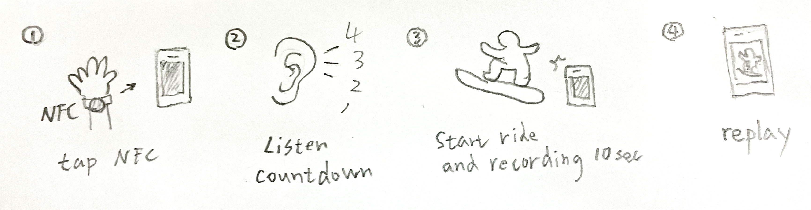
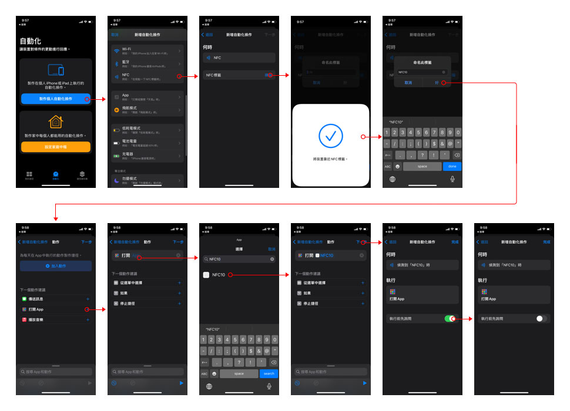

# NFC10

Prototype version 1.0

## Why made this?
NFC10 made for [Ya Park](https://hanpo.co/2020/10/01/YaPark/) dry ski slope training. When we shred on snowboard, we wear gloves to protect hands, so we need to use NFC tag to control recording video and replay it. In Japan, they use DVR system, but it expensive and not immediate.

## Work Flow

## User Testing

## Video Recording Sample

## Shortcut NFC Setup

## TODO
* App Group: Video replay app
* Save to album(From video replay app)
* Analyze and compare actions
* Improve battery life